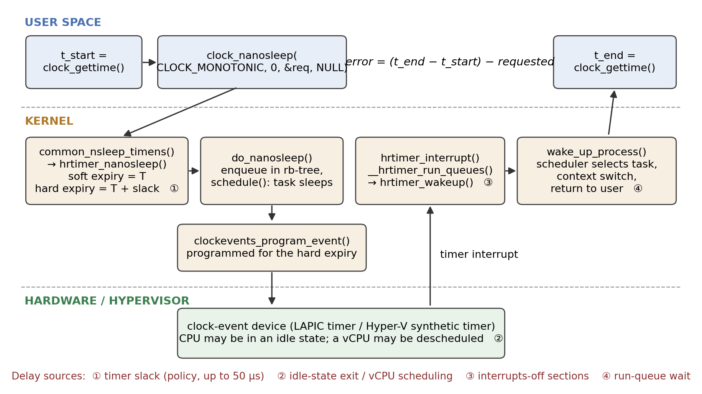
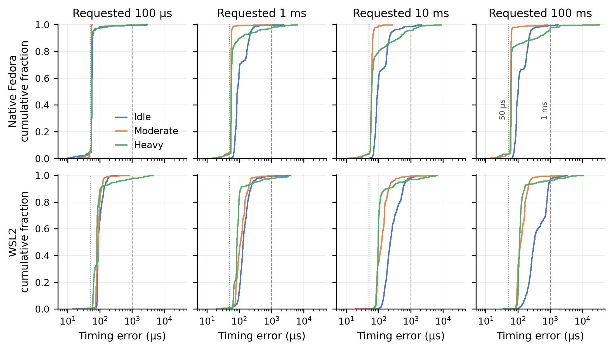
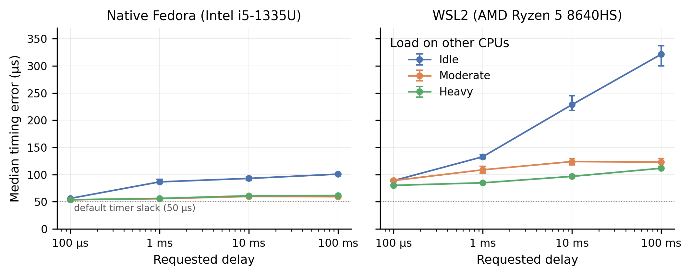
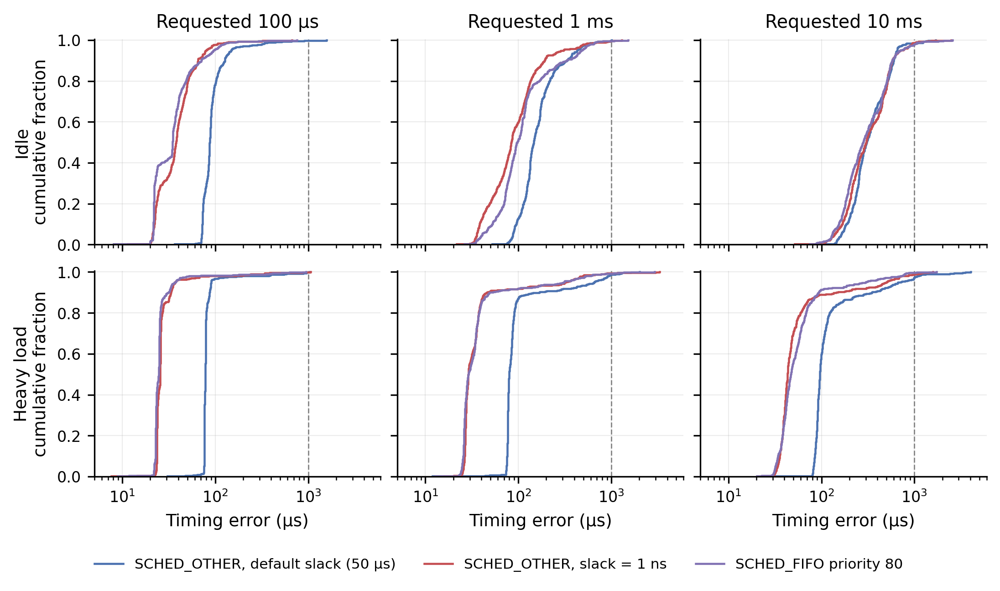
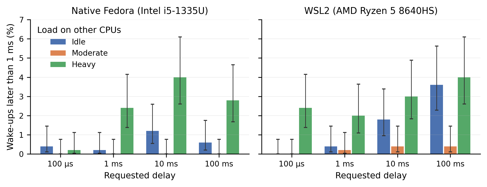
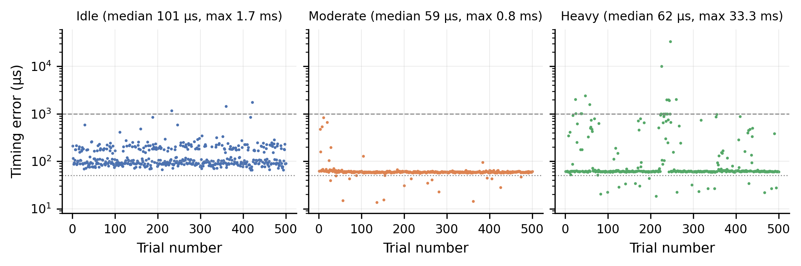

# Nanosecond Resolution, Microsecond Floors, Millisecond Tails

<p class="subtitle">A measurement case study of Linux high-resolution timers as seen from user space</p>

<p class="meta">Operating Systems case study · Kernel time management · Benchmark comparison with kernel-source exploration<br>Project repository: https://github.com/Arrav-SP/linux-hrtimer-os-project</p>

## Abstract

Linux advertises a clock resolution of 1 ns, and its high-resolution timer (hrtimer) subsystem can program a timer interrupt for an arbitrary nanosecond. This study asks how much of that resolution survives the trip to an ordinary application. A small C benchmark calls `clock_nanosleep(CLOCK_MONOTONIC)` for 100 µs, 1 ms, 10 ms and 100 ms, pinned to one CPU, while 0, 6 or 11 busy threads occupy the other CPUs. It was run on native Fedora (kernel 7.1.5, Intel i5-1335U) and under WSL2 (AMD Ryzen 5 8640HS): 12,000 wake-ups in total, with a further 9,000 collected in a control experiment during report preparation.

Three results stand out. First, the error has a hard floor that has nothing to do with timer resolution: on native Linux the median wake-up is 53.7–61.5 µs late whenever other CPUs are busy, which is the kernel's default 50 µs timer slack plus a wake-up path of a few microseconds. The control experiment confirms the mechanism: setting the slack to 1 ns lowers the WSL2 median under load by 51–53 µs. Second, an idle machine keeps time worse than a busy one. Idle medians rise with the requested sleep (to 101 µs native and 322 µs under WSL2 at 100 ms) and fall back to the floor as soon as neighbouring CPUs are loaded. Third, heavy load leaves the median untouched but produces a tail: 2.4 % of native and 2.9 % of WSL2 wake-ups are more than 1 ms late, up to 33 ms, although no load thread ever runs on the benchmark's CPU.

The delays an application sees are therefore set by policy (slack), power management (idle states), scheduling and virtualisation, not by the precision of the timer. The study measures application-visible wake-up time only; attributions to specific kernel mechanisms are marked as interpretation or hypothesis wherever they were not tested directly.

## 1. Introduction

A program that needs to act periodically, such as an audio callback, a control loop or a packet pacer, usually ends up in a sleep call. On Linux that call is served by hrtimers, which replaced tick-granular timeouts with timers ordered by nanosecond expiry times [1]. It is tempting to read "high resolution" as "high accuracy". The two are different properties. Resolution is the granularity with which an expiry time can be expressed and programmed. What an application experiences is the time at which its next instruction runs, which also depends on every stage between the timer interrupt and the return to user space.

The project [16] built a benchmark and an automated experiment to measure that end-to-end quantity under controlled delay and load conditions, in two execution environments, and studied the kernel source to explain what was measured.

**Research question.** When a normal (non-real-time) Linux process requests a sleep through the hrtimer-backed `clock_nanosleep()` interface, how late does it actually resume, how does that lateness depend on the requested interval and on CPU load elsewhere in the machine, and which parts of the lateness come from the timer mechanism itself rather than from the rest of the operating system?

**Objectives.**

1. Trace the path from `clock_nanosleep()` to wake-up in the kernel source and identify where delay can enter.
2. Measure the wake-up error distribution for four intervals and three load levels on native Linux and on WSL2.
3. Separate the typical case from the tail and test, where possible, which mechanism accounts for each.
4. State what the measurements do and do not establish.

The report keeps three kinds of statement apart: an *observation* is something present in the recorded data, an *interpretation* is a mechanism that the kernel source or documentation makes likely, and a *hypothesis* is a candidate explanation that this project did not test.

## 2. Background and Literature Survey

### 2.1 From the periodic tick to hrtimers

Classical UNIX-style kernels keep time by counting periodic timer interrupts, and a timeout expires at the first tick after its deadline [8]. Linux's tick frequency is the compile-time constant `HZ`; with `HZ=250`, as in the WSL2 kernel used here, a tick-based timeout has 4 ms granularity. The original timer wheel is built around this tick counter (`jiffies`). It is efficient for the many timeouts that are cancelled before they fire, but it cannot express sub-tick expiry.

Gleixner and Niehaus [1] describe the redesign that removed this limit. Time-of-day reading was abstracted into *clock sources*, interrupt generation into *clock event devices* that can be programmed for a one-shot event at an arbitrary time, and precise timers were moved into a separate subsystem that keeps them in a red-black tree ordered by absolute expiry. The kernel documentation gives the rationale for keeping two subsystems: the timer wheel is tuned for timeouts and its cascading cost is unsuitable for timers that are expected to expire [9], [10]. The same infrastructure made dynamic ticks possible, so that an idle CPU need not be woken periodically.

The kernel copy in the repository shows the result directly. `kernel/time/hrtimer.c` defines `HIGH_RES_NSEC` as 1 (line 81), which becomes `hrtimer_resolution` once the system switches to high-resolution mode and is what `clock_getres()` returns. The project's `check_resolution` program reports exactly that value, 1 ns, on the WSL2 system.

### 2.2 The sleep path in the kernel source

The repository contains the time-management sources of a Linux 7.3-rc1 tree (`linux_source/`). Tracing the benchmark's system call through those files gives the path in Figure 1.

`clock_nanosleep` (`posix-timers.c:1383`) dispatches through the clock's `nsleep` operation, which for `CLOCK_MONOTONIC` is `common_nsleep_timens` (line 1462) and calls `hrtimer_nanosleep`. That function places an `hrtimer_sleeper` on the stack and arms it with one line that matters a great deal for this study (`hrtimer.c:2474`):

```c
hrtimer_set_expires_range_ns(&t.timer, rqtp, current->timer_slack_ns);
```

The timer is given a *range*: a soft expiry equal to the requested time and a hard expiry later by the task's timer slack. `do_nanosleep` then enqueues the timer and calls `schedule()`. The two expiry values are used differently. `hrtimer_reprogram` programs the clock-event device from `hrtimer_get_expires()`, the hard expiry (line 851), whereas `__hrtimer_run_queues` expires any timer whose soft expiry has passed (line 2121). The comment at that point says the goal is "minimizing wakeups". A sleeping task therefore wakes at its requested time only if some other timer interrupt happens to occur on that CPU inside the slack window; otherwise it wakes at the end of the window. The default slack for normal tasks is 50 µs and it is not applied to real-time scheduling policies [11]; `/proc/self/timerslack_ns` on the test system reads 50000.

When the interrupt arrives, `hrtimer_interrupt` runs the expired timers in hard-interrupt context; the sleeper's callback, `hrtimer_wakeup` (line 2316), calls `wake_up_process()`. From there the task is merely runnable. It executes when the scheduler selects it and the kernel returns to user space. The scheduler sources are not part of the repository snapshot, so that last stage is described from documentation rather than traced.

This gives four places where lateness can arise, marked in Figure 1: (1) slack, a deliberate policy; (2) the time for the CPU, or a virtual CPU, to leave an idle state and take the interrupt [13]; (3) sections where interrupts are disabled; (4) waiting on the run queue. Only the first is part of the timer subsystem.

<figure><figcaption><b>Figure 1.</b> Path of one benchmark iteration, from the kernel sources in the repository. The benchmark observes only the two user-space timestamps; everything between them contributes to the measured error. Numbered markers show where delay can enter.</figcaption></figure>

### 2.3 Related research

**Latency of general-purpose Linux.** Abeni et al. [2] measured the real-time behaviour of Linux and decomposed kernel latency into a timer-resolution component and a non-preemptible-section component, showing that a high-resolution timer removes the first but leaves the second. The present study is in the same tradition with a simpler instrument, and reaches a compatible conclusion on a current kernel: with resolution no longer a limit, the remaining error comes from elsewhere.

**Real-time Linux.** Reghenzani, Massari and Fornaciari [4] survey PREEMPT_RT, in which hrtimers are one ingredient among threaded interrupts, preemptible locks and priority inheritance. Their survey makes clear that bounded latency is a property of the whole kernel execution model. De Oliveira et al. [5] go further and derive the scheduling latency of PREEMPT_RT from a formal model of thread synchronisation, measuring the contributing terms with kernel tracing. They point out that the usual black-box tool, `cyclictest`, which measures the same quantity as this project's benchmark, reports a latency value without identifying its cause. That criticism applies here and shapes the limitations in Section 5.4.

**Timers as a source of interference.** Tsafrir et al. [3] showed that periodic clock ticks are a measurable source of operating-system noise for fine-grained parallel applications. Patel, Vanga and Brandenburg [6] showed that timer interrupts armed by low-priority tasks delay high-priority tasks and proposed shielding against them. Both treat timer activity as something that disturbs other work. Timer slack is the general-purpose kernel's answer to the same cost, trading punctuality of each timer for fewer interrupts, and this study measures what that trade costs the sleeping task.

**Virtualisation.** Under a hypervisor a guest's CPUs are virtual CPUs scheduled by the host, and timer interrupts are delivered by a virtual device [7]. WSL2 runs a real Linux kernel in a lightweight Hyper-V virtual machine [14], and the guest's clock-event device is the Hyper-V synthetic timer [15]. Timer delivery therefore includes host-side behaviour that the guest kernel cannot observe.

**Position of this work.** The cited studies either target real-time kernels with tracing support or analyse one mechanism in depth. This project looks at the default case that most programs actually run in (normal scheduling class, default slack, stock distribution kernel, laptop power management, and a consumer virtualisation layer) and asks which of the textbook mechanisms dominate there. Its contribution is empirical and modest: a reproducible measurement, an analysis of where the centre and the tail of the distribution come from, and one control experiment that turns the main interpretation into a tested result.

## 3. Methodology and Implementation

### 3.1 Benchmark

`src/timer_benchmark.c` (185 lines of C) takes a delay in nanoseconds and a trial count. Each trial is:

```c
clock_gettime(CLOCK_MONOTONIC, &start);
clock_nanosleep(CLOCK_MONOTONIC, 0, &requested, NULL);   /* relative sleep */
clock_gettime(CLOCK_MONOTONIC, &end);
error_ns = (end - start) - requested_ns;
```

Every trial is written as a CSV row (`trial, requested_ns, actual_ns, error_ns`) and a summary is printed to standard error. The sleep is relative (flags = 0 [12]), so errors do not accumulate from one trial to the next. The CSV row is written outside the timed interval.

The measured error is the whole of Figure 1: system-call entry, timer arming, slack, interrupt delivery, wake-up, scheduling, return to user space and the second clock read. It is **not** a measurement of when the hrtimer expired inside the kernel, and it cannot be split into those stages. It can never be negative, and in 21,000 recorded trials it never is (minimum 7.6 µs).

### 3.2 Load generation and CPU placement

`src/cpu_load.c` starts N threads that each run an arithmetic loop for a fixed time. The experiment scripts (`scripts/run_final_experiment.sh`, `run_native_experiment.sh`) pin the benchmark to CPU 0 with `taskset` and confine the load to other CPUs:

| Load level | Load threads | Allowed CPUs for load | CPUs left without a load thread |
|---|---|---|---|
| Idle | 0 | none | 0–11 |
| Moderate | 6 | 1–6 | 0, 7–11 |
| Heavy | 11 | 1–11 | 0 only |

**Table 1.** Load conditions. The benchmark always runs on CPU 0.

This placement is central to interpreting the results. The load never competes with the benchmark for CPU 0. "Load" in this experiment means load *elsewhere in the machine*, and any effect on the benchmark is indirect: through the shared physical core (CPU 1 is the hyper-thread sibling of CPU 0 on both machines), through power and frequency management, through the hypervisor, or through whatever other system activity is displaced onto CPU 0 when every other CPU is occupied.

### 3.3 Experimental design and environments

Four delays (100 µs, 1 ms, 10 ms, 100 ms) by three load levels give 12 conditions, each with 500 consecutive trials: 6,000 observations per environment. Each condition was run once, in a fixed order (all idle conditions, then moderate, then heavy), with the load started one second before the benchmark.

| | Native Linux | WSL2 |
|---|---|---|
| Processor | Intel Core i5-1335U, 2 P-cores (4 threads) + 8 E-cores | AMD Ryzen 5 8640HS, 6 cores / 12 threads |
| Logical CPUs | 12 | 12 (virtual) |
| OS / kernel | Fedora 44, 7.1.5-200.fc44, PREEMPT_DYNAMIC | Ubuntu on WSL2; 6.18.33.2-microsoft-standard-WSL2, HZ=250, NO_HZ_IDLE (recorded at control run) |
| Clock-event device | not recorded | Hyper-V synthetic timer |
| Frequency governor | powersave | managed by Windows host |
| Compiler | GCC 16.1.1, `-O2` | GCC 15.2.0, `-O2` (control run) |
| Main run | 8 September 2026 | 5 September 2026 |

**Table 2.** Test environments. Native details come from `data/native_analysis/fedora_environment.txt`. The WSL2 environment was not recorded at the time of the main run; the values shown were captured during the control experiment on the same machine a month later.

The two environments differ in processor vendor, core architecture, kernel version, tick configuration and power management as well as in virtualisation. The comparison between them is observational.

### 3.4 Control experiment (performed during report preparation)

The analysis in Section 4 pointed to timer slack as the origin of the error floor. Because that is a testable claim, a control experiment was added on 8 October 2026 on the WSL2 machine (`final_report/supplementary/`). The benchmark source, pinning and load generator are unchanged. Three variants were run back to back for each of 100 µs, 1 ms and 10 ms under idle and heavy load, 500 trials each (9,000 observations):

- **default**: `SCHED_OTHER`, slack 50 µs, a repeat of the main experiment;
- **slack = 1 ns**: a short wrapper (`slackexec.c`) calls `prctl(PR_SET_TIMERSLACK, 1)` and then executes the unmodified benchmark, which inherits the setting;
- **SCHED_FIFO**: the benchmark is started with `chrt -f 80`, which gives it real-time priority over every normal task on CPU 0 and, as a side effect, exempts it from slack [11].

This experiment could not be repeated on the native machine, which was not available.

### 3.5 Analysis pipeline

The original pipeline (`scripts/analyze_*.py`, `scripts/plot_*.py`) computes per-condition summaries and five figures per environment. It was re-run for this report and reproduces the committed summary files exactly. All numbers in this report are computed from the raw per-trial CSV files by `final_report/analysis/report_analysis.py`, which also checks every file for 500 rows, consecutive trial numbers and internally consistent error values, and asserts agreement with the committed summaries.

Because the distributions are strongly skewed, the analysis uses order statistics: median, inter-quartile range (IQR), 99th percentile and maximum, plus the fraction of wake-ups later than 1 ms. Medians carry bootstrap 95 % confidence intervals (4,000 resamples); tail fractions carry Wilson intervals; load levels are compared with Mann-Whitney and Fisher exact tests. Mean and standard deviation are deliberately not used as headline metrics, for reasons shown in Section 5.2.

## 4. Results

### 4.1 Overview

Table 3 gives summary statistics for every main-experiment condition and Figure 2 shows the full distributions.

<div class="small">

| Delay | Load | N p50 | N IQR | N p99 | N max | N >1 ms | W p50 | W IQR | W p99 | W max | W >1 ms |
|---|---|---|---|---|---|---|---|---|---|---|---|
| 100 µs | idle | 56.3 | 1.7 | 192.1 | 2,893 | 0.4 | 89.0 | 24.6 | 188.6 | 407.2 | 0.0 |
| 100 µs | moderate | 53.7 | 0.5 | 55.1 | 57.3 | 0.0 | 89.1 | 16.9 | 157.5 | 815.0 | 0.0 |
| 100 µs | heavy | 53.8 | 0.7 | 139.3 | 2,156 | 0.2 | 80.3 | 20.0 | 2,302 | 4,449 | 2.4 |
| 1 ms | idle | 86.7 | 80.4 | 298.7 | 2,387 | 0.2 | 133.0 | 60.7 | 610.7 | 3,908 | 0.4 |
| 1 ms | moderate | 55.7 | 0.8 | 69.7 | 997.2 | 0.0 | 108.9 | 61.1 | 413.6 | 1,181 | 0.2 |
| 1 ms | heavy | 56.2 | 4.4 | 2,472 | 6,184 | 2.4 | 85.0 | 14.9 | 2,990 | 3,365 | 2.0 |
| 10 ms | idle | 93.0 | 95.3 | 1,164 | 2,171 | 1.2 | 228.8 | 199.1 | 1,261 | 1,802 | 1.8 |
| 10 ms | moderate | 59.9 | 5.5 | 99.2 | 271.6 | 0.0 | 124.1 | 63.8 | 641.2 | 5,031 | 0.4 |
| 10 ms | heavy | 61.1 | 15.9 | 1,945 | 8,721 | 4.0 | 96.8 | 13.9 | 3,711 | 6,699 | 3.0 |
| 100 ms | idle | 100.9 | 93.4 | 592.1 | 1,745 | 0.6 | 321.5 | 510.3 | 1,941 | 3,469 | 3.6 |
| 100 ms | moderate | 59.4 | 2.3 | 159.2 | 833.6 | 0.0 | 123.2 | 65.9 | 411.4 | 2,517 | 0.4 |
| 100 ms | heavy | 61.5 | 2.3 | 1,994 | 33,324 | 2.8 | 111.7 | 19.5 | 3,752 | 10,831 | 4.0 |

</div>

**Table 3.** Wake-up error in microseconds, n = 500 per cell. N = native Fedora, W = WSL2. p50 = median, IQR = inter-quartile range, p99 = 99th percentile, max = largest observed value, ">1 ms" = percentage of trials later than 1 ms.

Two features are visible at once. The native curves under load are almost vertical just to the right of the 50 µs line, and in both environments the idle curve lies to the *right* of the loaded curves for every delay longer than 100 µs.

<figure><figcaption><b>Figure 2.</b> Empirical cumulative distributions of wake-up error for all 24 main conditions (500 trials each, logarithmic error axis). Dotted line: 50 µs default timer slack. Dashed line: 1 ms.</figcaption></figure>

### 4.2 The error floor is the timer slack

**Observation.** On native Linux with moderate load, the 100 µs sleep overshoots by a median of 53.7 µs with an IQR of 0.5 µs; 91 % of the 500 trials fall between 53 and 55 µs and the largest error in the run is 57.3 µs. Across all eight native loaded conditions the median lies between 53.7 and 61.5 µs (Figure 3). The WSL2 loaded medians are higher, 80 to 124 µs. A requested 100 µs sleep thus lasts about 154 µs on the native machine, an error of 54 % of the request, with a jitter of half a microsecond.

<figure><figcaption><b>Figure 3.</b> Median wake-up error with bootstrap 95 % confidence intervals. Most intervals are smaller than the markers.</figcaption></figure>

**Interpretation.** A constant offset of this size with sub-microsecond spread is not latency in the usual sense. It matches the source-level behaviour in Section 2.2: the hardware event is programmed for the hard expiry, 50 µs after the requested time, and the remaining 4 µs or so is the interrupt, wake-up and return path of the native machine.

A second feature of the data supports this reading. If the timer is normally serviced at the end of the slack window, it should occasionally be serviced early, whenever an unrelated timer interrupt lands on CPU 0 inside the window. Native loaded runs contain exactly such a population: 3.2 to 6.4 % of trials per condition have an error *below* 50 µs, spread between about 10 and 50 µs (visible as the small foot of each native curve in Figure 2 and as the scattered low points in Figure 6). Under WSL2 the fraction is 0.2 to 1.0 %.

**Test.** The control experiment removes the slack and leaves everything else unchanged (Table 4, Figure 4). Under heavy load the WSL2 median falls from 78.4 to 25.6 µs at 100 µs, from 79.6 to 28.9 µs at 1 ms and from 96.2 to 43.2 µs at 10 ms: a shift of 50.7 to 53.0 µs in each case, with the shape of the distribution otherwise preserved. `SCHED_FIFO`, which is exempt from slack, gives the same heavy-load medians as slack = 1 ns to within 4 µs. The floor is therefore established as timer slack for WSL2. For the native machine the same conclusion rests on the source code and the matching magnitude, since the control could not be run there.

| Load | Delay | D p50 | D p99 | D >1 ms | S p50 | S p99 | S >1 ms | F p50 | F p99 | F >1 ms |
|---|---|---|---|---|---|---|---|---|---|---|
| idle | 100 µs | 87.1 | 444.5 | 1 | 37.9 | 137.6 | 0 | 34.6 | 166.2 | 0 |
| idle | 1 ms | 146.5 | 682.6 | 1 | 83.8 | 872.4 | 2 | 97.6 | 684.5 | 2 |
| idle | 10 ms | 307.6 | 1,236 | 8 | 302.8 | 1,044 | 7 | 282.2 | 1,187 | 10 |
| heavy | 100 µs | 78.4 | 550.5 | 1 | 25.6 | 240.6 | 1 | 24.7 | 349.5 | 0 |
| heavy | 1 ms | 79.6 | 1,109 | 6 | 28.9 | 776.0 | 3 | 29.0 | 784.5 | 4 |
| heavy | 10 ms | 96.2 | 1,334 | 14 | 43.2 | 1,020 | 6 | 46.8 | 777.7 | 2 |

**Table 4.** Control experiment on WSL2 (8 October 2026), n = 500 per cell. D = default (SCHED_OTHER, 50 µs slack), S = slack set to 1 ns, F = SCHED_FIFO. Median (p50) and 99th percentile (p99) in microseconds; ">1 ms" is the number of trials out of 500.

<figure><figcaption><b>Figure 4.</b> Control experiment on WSL2: error distributions with default slack, with slack set to 1 ns, and under SCHED_FIFO. Dashed line: 1 ms.</figcaption></figure>

With slack removed, what remains under heavy load (about 26 µs) is the cost of the WSL2 wake-up path itself. The corresponding native figure, inferred by subtracting 50 µs, is about 4 µs. The difference is suggestive of virtual-interrupt delivery cost, but the two machines also differ in hardware, so it is not attributed.

### 4.3 An idle system is later than a loaded one

**Observation.** With no load, the median error rises with the requested delay: 56, 87, 93 and 101 µs on native Linux, and 89, 133, 229 and 322 µs under WSL2. Adding load on other CPUs brings it back down. On the native machine the probability that a randomly chosen idle trial is later than a randomly chosen moderate-load trial is between 0.94 and 0.99 for all four delays (Mann-Whitney, p < 10<sup>−120</sup>). The effect is as large in the spread as in the centre: at 1 ms the native IQR is 80.4 µs when idle and 0.8 µs under moderate load. The idle distributions for 1 to 100 ms are bimodal, with about two thirds of trials near 85 to 90 µs and 26 to 31 % near 185 to 200 µs (the two bands in the left panel of Figure 6).

The control run, taken a month later, reproduces the pattern on WSL2 (idle medians 87, 147 and 308 µs for 100 µs, 1 ms and 10 ms).

**Interpretation.** Between trials an idle CPU 0 has nothing to run and enters an idle state; the longer the expected sleep, the deeper the state the idle governor is permitted to choose, and deeper states take longer to leave [13]. The timer interrupt must first bring the CPU out of that state. Two discrete bands are what two idle states with different exit latencies would produce. Load on CPU 1, the hyper-thread sibling, keeps the shared physical core active and at a higher frequency, which removes this cost; that fits the collapse of both median and spread as soon as the moderate load starts. Under WSL2 the same logic applies one level down: an idle virtual CPU is descheduled by the host and must be rescheduled before the guest can take its timer interrupt.

**What is not established.** The experiment did not record idle-state residency or frequency and did not vary idle-state limits, the governor or the sibling's load independently. Idle-state exit, frequency ramp-up and cold caches would all produce a penalty that grows with sleep length, and the data cannot separate them. Two further cautions apply. The load conditions were run in a fixed order, so load is confounded with time since the start of the session. And one control result does not fit a simple additive picture: at 10 ms idle, removing the slack did not move the median at all (307.6 against 302.8 µs), although it removed 49 µs at 100 µs idle. A candidate explanation is that timer delivery to a long-idle virtual CPU is quantised or coalesced on the host side, which would make a 50 µs difference in the requested expiry invisible. This was not tested.

### 4.4 Heavy load adds a tail and leaves the centre alone

**Observation.** Going from moderate to heavy load changes the native median by at most 2.1 µs. What changes is the tail (Figure 5, Table 3): pooled over the four delays, the fraction of native wake-ups later than 1 ms is 0 of 2,000 under moderate load and 47 of 2,000 (2.35 %) under heavy load; for WSL2 it is 5 of 2,000 and 57 of 2,000 (2.85 %). The difference between heavy and moderate is significant in seven of the eight delay-environment pairs (Fisher exact, p ≤ 0.012); the exception is native 100 µs, a run that lasts less than a tenth of a second. The largest observed errors are 33.3 ms (native) and 10.8 ms (WSL2), both at 100 ms under heavy load.

<figure><figcaption><b>Figure 5.</b> Percentage of wake-ups more than 1 ms late, with Wilson 95 % intervals (n = 500 per bar).</figcaption></figure>

<figure><figcaption><b>Figure 6.</b> Per-trial error for the 100 ms sleep on native Fedora, in run order. Dotted line: 50 µs; dashed line: 1 ms. Idle shows two bands; moderate load sits on the slack floor with occasional early expiries below it; heavy load keeps the same floor and adds bursts of late wake-ups.</figcaption></figure>

The late wake-ups are not spread evenly through a run. In the native 100 ms heavy run (Figure 6, right), 8 of the 14 trials above 1 ms occur between trials 226 and 260, including the two largest values, 10.1 and 33.3 ms, and several of them are four trials (about 0.4 s) apart. The sizes are not arbitrary either: of the 65 native heavy-load errors above 0.8 ms, 16 lie between 0.99 and 1.02 ms and seven more between 1.93 and 2.03 ms. The WSL2 tail shows no such clustering at whole milliseconds.

**Interpretation.** No load thread is allowed on CPU 0, so the tail cannot be direct competition with the load. What distinguishes heavy from moderate load is that CPU 0 becomes the only CPU without a spinning thread. Any other runnable work in the system, such as kernel worker threads, daemons, the desktop and the experiment's own shell, is then most cheaply placed on CPU 0, where it meets the benchmark. Under moderate load the same work has five other free CPUs and the tail is absent. A normal-class task that wakes while another is running is not guaranteed to preempt it immediately; it may wait until the scheduler's next decision point. Errors that cluster at 1 and 2 ms are what waiting for a 1 kHz scheduler tick would look like.

**What is not established.** The tick rate of the Fedora kernel was not recorded, and no scheduler trace was taken, so the run-queue explanation for the native tail remains an interpretation consistent with the quantisation, not a demonstrated cause. Thermal throttling after tens of seconds at full load, and contention from the sibling thread, would also lengthen wake-ups and were not excluded.

For WSL2 the control experiment gives a partial test. If the tail were only competition with normal tasks inside the guest, `SCHED_FIFO` at priority 80 should remove it. It did not: under heavy load the FIFO runs still show 99th percentiles of 350 to 785 µs and maxima of 0.95 to 2.9 ms (Table 4). The count of wake-ups above 1 ms was lower with FIFO (6 of 1,500) than with the default (21 of 1,500; Fisher p = 0.006), but the slack-only variant, which has no scheduling advantage, also came out lower (10 of 1,500), so single runs differ by amounts comparable to the apparent FIFO effect. The safe statement is that real-time priority inside the guest does not eliminate millisecond-scale delays under WSL2. This is consistent with a source below the guest scheduler, such as host scheduling of the virtual CPU, but the host was not instrumented.

### 4.5 Reproducibility of the main result

The control experiment's default variant repeats six of the main WSL2 conditions a month later. Heavy-load medians agree closely (78.4, 79.6, 96.2 µs against 80.3, 85.0, 96.8 µs). Idle medians agree in pattern but less in value (87, 147, 308 µs against 89, 133, 229 µs), and tail counts vary by a factor of two or more between runs. The centre of the distribution under load is therefore a stable property of the system; idle behaviour and tails are sensitive to system state and should be read as indicative.

## 5. Critical Discussion

### 5.1 Resolution and determinism are separate properties

The project set out to examine the gap between timer resolution and application-level timing. The data support the distinction, with more structure than a single gap. The interface resolution is 1 ns. The best typical accuracy observed with default settings is 53.7 µs, more than four orders of magnitude coarser, and that figure is a design decision: the kernel delays normal tasks' timers on purpose so that wake-ups can be batched. The next layer, tens to hundreds of microseconds on an idle system, belongs to power management. The last, milliseconds in a few percent of wake-ups, belongs to scheduling and, under WSL2, to the hypervisor. None of the three is a deficiency of the hrtimer mechanism, and none would be improved by a finer timer.

### 5.2 Choice of metric

The original project figures plot the mean with standard-deviation error bars. For this data that representation misleads: in the native 100 ms heavy condition the five largest of 500 samples account for 42 % of the summed error, the mean (237.6 µs) is nearly four times the median (61.5 µs), and the error bar extends to negative values that cannot occur. A single 33 ms event determines the picture. The original 1 ms box plots have the opposite fault: outliers are hidden, so heavy load looks nearly as good as moderate load. Distribution plots and exceedance fractions were used here instead.

The 99th percentile also deserves caution. With 500 samples it is fixed by the five largest values, and its bootstrap interval is wide: for native 100 µs idle the p99 of 192 µs has a 95 % interval of 99 to 977 µs. Observed maxima are reported as observed maxima; they say nothing about a worst case.

### 5.3 Status of the findings

Table 5 summarises how far each of the main claims is supported.

| Finding | Status | Basis |
|---|---|---|
| The benchmark's sleep path arms an hrtimer with a slack range and the device is programmed for the hard expiry | Verified in source | `hrtimer.c` lines 851, 2121, 2474 |
| About 50 µs of the WSL2 median error is timer slack | Tested | Control experiment: median falls by 49–63 µs in 5 of 6 cells (no change at 10 ms idle) |
| The native 54 µs floor is slack plus about 4 µs of path | Interpretation | Same code path, matching magnitude, early-expiry population; no native control |
| Idle systems wake later, increasingly so for longer sleeps | Observed in both environments, replicated on WSL2 | Sections 4.3, 4.5 |
| The idle penalty is idle-state exit latency | Hypothesis | Fits bimodality and sibling-load effect; residency not measured |
| Heavy load adds a millisecond tail without moving the median | Observed in both environments | Section 4.4 |
| The native tail is run-queue waiting on CPU 0 | Interpretation | 1 ms and 2 ms clustering; no trace |
| Under WSL2, real-time priority does not remove the tail | Tested (single run) | Control experiment |
| Native Linux keeps better time than WSL2 | Not established | Different hardware and kernels |

**Table 5.** Status of the main findings.

### 5.4 Limitations

1. **Black-box measurement.** Only two user-space timestamps are taken. Timer expiry, interrupt entry, wake-up and context switch are not timestamped, so the decomposition of the error into stages is inferred. The repository's `kernel_module/` directory, intended for kernel-side instrumentation, is empty.
2. **One run per condition, fixed order.** There are no repeated runs of the main experiment and conditions were not randomised. Load level is confounded with elapsed time and temperature. The replication in Section 4.5 shows tails vary substantially between runs.
3. **Unequal exposure.** 500 trials of a 100 µs sleep span under 0.1 s of wall time; 500 trials of 100 ms span 50 s. Short-delay runs sample a brief snapshot of system state and can miss, or be dominated by, a single burst. The apparent growth of the tail with delay may partly reflect this.
4. **Sibling thread not isolated.** CPU 1 is a hyper-thread of CPU 0 on both machines and is in both load sets. The effect of load on the sibling cannot be separated from the effect of load on other cores. The repository documentation already notes this for the native machine.
5. **Environments are not comparable as a pair.** The native and WSL2 machines differ in processor, core layout, kernel version and tick rate. No statement about the cost of virtualisation is supported.
6. **Environment recording is incomplete.** The WSL2 kernel version at the main run was not saved. Neither run recorded the tick rate, idle driver and states, preemption mode, or the default slack; these were recovered for WSL2 only, a month later.
7. **Kernel source mismatch.** The source snapshot studied (7.3-rc1) is not the version of either running kernel (7.1.5, 6.18.33). The sleep path described is long-standing, but line numbers refer to the snapshot, and scheduler and header files are not included.
8. **Workload realism.** The load is pure user-space computation. It generates no I/O, interrupts, memory pressure or lock contention, which are the classical sources of long kernel latencies [2], [5].
9. **Control experiment scope.** It was run only on WSL2, once, a month after the main run and possibly on a different kernel build.

### 5.5 Real-world implications

*Short periodic sleeps cost more than they appear to.* Any loop that sleeps for 100 µs with default settings runs at roughly 154 µs per iteration on the native machine and 180 to 190 µs under WSL2, before doing any work. Software pacing packets or polling a device at that rate should either set its timer slack explicitly with `prctl(PR_SET_TIMERSLACK)` or be written against absolute deadlines. The benefit is specific and measured: about 50 µs per wake-up.

*Quiet systems are not the best case.* Benchmarking a latency-sensitive program on an idle laptop gave the worst typical figures in this study. Robotics and control applications on general-purpose hardware commonly restrict idle states or keep a core busy for this reason; the data illustrate the effect that practice addresses, though they do not measure the remedy.

*Median behaviour says little about deadlines.* A multimedia or control task with a 1 ms tolerance would have met it in every one of 2,000 native trials under moderate load and missed it in about one of every 40 under heavy load, with an unchanged median. Capacity planning from typical latency is unsafe for such tasks.

*Real-time priority helps the centre but is no guarantee on a virtualised desktop.* In the WSL2 control run `SCHED_FIFO` reduced the median to about 25 µs but millisecond delays persisted. This agrees with the literature's position that bounded latency needs control of the whole stack [4], [5]. WSL2 is a convenient development environment, and these results give no basis for treating it as a timing-accurate one.

### 5.6 Future work

Each item follows from a limitation above.

- **Kernel-side timestamps.** Use the `timer:hrtimer_expire_entry` and `sched:sched_wakeup`/`sched_switch` tracepoints, or a small module in the empty `kernel_module/` directory, to split the error into slack, interrupt-delivery and run-queue components. This would test the run-queue interpretation of the native tail directly.
- **Slack control on native hardware.** Repeat Section 3.4 on the Fedora machine to turn the 54 µs interpretation into a tested result.
- **Idle-state experiment.** Repeat the idle conditions with deep idle states disabled (`cpupower idle-set` or the PM QoS latency interface) and with the performance governor, recording residency, to test the idle-exit hypothesis.
- **Sibling isolation.** Run load sets that exclude CPU 1, and a set that loads only CPU 1.
- **Design.** Randomise condition order, repeat each condition several times, and equalise wall-clock duration across delays instead of trial count.
- **Same-hardware virtualisation comparison.** Boot native Linux on the WSL2 machine so that virtualisation is the only change.

## 6. Conclusion

The study measured 21,000 sleeps through the Linux hrtimer path and found that the precision of the timer mechanism is not what limits an ordinary application. With default settings a process is woken about 54 µs late on native Linux with remarkable regularity, because the kernel is instructed to wait that long; the control experiment showed that removing the 50 µs slack removes 50 µs of error. On an idle machine wake-ups are later and more variable, and increasingly so for longer sleeps, most plausibly because the processor or virtual processor must first be brought out of an idle state. When every other CPU is busy, the typical wake-up is unaffected but two to three in every hundred are more than a millisecond late, and under WSL2 real-time priority does not prevent this.

What can be stated with confidence is the shape of the behaviour, the size and origin of the slack floor on WSL2, and the independence of the tail from the median. What cannot be stated is which kernel or host mechanism produced any individual late wake-up, how the two environments would compare on equal hardware, or what the worst case is. High timer resolution is a necessary condition for deterministic application timing and, on a general-purpose system, a small part of it; the remainder is decided by slack policy, power management, the scheduler and the hypervisor, each of which trades punctuality for something else the system values.

## References

**Research papers**

[1] Gleixner, T., & Niehaus, D. (2006). Hrtimers and beyond: Transforming the Linux time subsystems. *Proceedings of the Ottawa Linux Symposium*, *1*, 333–346. https://www.kernel.org/doc/ols/2006/ols2006v1-pages-333-346.pdf

[2] Abeni, L., Goel, A., Krasic, C., Snow, J., & Walpole, J. (2002). A measurement-based analysis of the real-time performance of Linux. *Proceedings of the Eighth IEEE Real-Time and Embedded Technology and Applications Symposium*, 133–142. https://doi.org/10.1109/RTTAS.2002.1137388

[3] Tsafrir, D., Etsion, Y., Feitelson, D. G., & Kirkpatrick, S. (2005). System noise, OS clock ticks, and fine-grained parallel applications. *Proceedings of the 19th Annual International Conference on Supercomputing*, 303–312. https://doi.org/10.1145/1088149.1088190

[4] Reghenzani, F., Massari, G., & Fornaciari, W. (2019). The real-time Linux kernel: A survey on PREEMPT_RT. *ACM Computing Surveys*, *52*(1), 1–36. https://doi.org/10.1145/3297714

[5] de Oliveira, D. B., Casini, D., de Oliveira, R. S., & Cucinotta, T. (2020). Demystifying the real-time Linux scheduling latency. *32nd Euromicro Conference on Real-Time Systems (ECRTS 2020), Leibniz International Proceedings in Informatics*, *165*, 9:1–9:23. https://doi.org/10.4230/LIPIcs.ECRTS.2020.9

[6] Patel, P., Vanga, M., & Brandenburg, B. B. (2017). TimerShield: Protecting high-priority tasks from low-priority timer interference. *2017 IEEE Real-Time and Embedded Technology and Applications Symposium (RTAS)*, 3–12. https://doi.org/10.1109/RTAS.2017.40

[7] Barham, P., Dragovic, B., Fraser, K., Hand, S., Harris, T., Ho, A., Neugebauer, R., Pratt, I., & Warfield, A. (2003). Xen and the art of virtualization. *ACM SIGOPS Operating Systems Review*, *37*(5), 164–177. https://doi.org/10.1145/1165389.945462

**Book**

[8] Silberschatz, A., Galvin, P. B., & Gagne, G. (2018). *Operating system concepts* (10th ed.). Wiley.

**Web sources**

[9] The Linux Kernel Organization, “hrtimers - subsystem for high-resolution kernel timers,” The Linux Kernel documentation, 2026. [Online]. Available: https://docs.kernel.org/timers/hrtimers.html. [Accessed: 09-10-2026].

[10] The Linux Kernel Organization, “High resolution timers and dynamic ticks design notes,” The Linux Kernel documentation, 2026. [Online]. Available: https://docs.kernel.org/timers/highres.html. [Accessed: 09-10-2026].

[11] Linux man-pages project, “PR_SET_TIMERSLACK(2const) - Linux manual page,” man7.org, 2026. [Online]. Available: https://man7.org/linux/man-pages/man2/PR_SET_TIMERSLACK.2const.html. [Accessed: 09-10-2026].

[12] Linux man-pages project, “clock_nanosleep(2) - Linux manual page,” man7.org, 2026. [Online]. Available: https://man7.org/linux/man-pages/man2/clock_nanosleep.2.html. [Accessed: 09-10-2026].

[13] The Linux Kernel Organization, “CPU Idle Time Management,” The Linux Kernel documentation, 2026. [Online]. Available: https://docs.kernel.org/admin-guide/pm/cpuidle.html. [Accessed: 09-10-2026].

[14] Microsoft, “Comparing WSL Versions,” Microsoft Learn, 2026. [Online]. Available: https://learn.microsoft.com/en-us/windows/wsl/compare-versions. [Accessed: 09-10-2026].

[15] Microsoft, “Hypervisor Top Level Functional Specification: Timers,” Microsoft Learn, 2026. [Online]. Available: https://learn.microsoft.com/en-us/virtualization/hyper-v-on-windows/tlfs/timers. [Accessed: 09-10-2026].

[16] Arrav-SP and Dhvanit8, “linux-hrtimer-os-project,” GitHub, 2026. [Online]. Available: https://github.com/Arrav-SP/linux-hrtimer-os-project. [Accessed: 09-10-2026].

## Appendix A. Reproduction

**Build** (Linux or WSL2, GCC):

```
gcc -O2 -Wall -Wextra -pthread src/timer_benchmark.c -o build/timer_benchmark -lm
gcc -O2 -Wall -Wextra -pthread src/cpu_load.c -o build/cpu_load
```

**Main experiment** (about four minutes per environment; the scripts expect the repository at the path set in their `PROJECT` variable):

```
bash scripts/run_final_experiment.sh        # WSL2
bash scripts/run_native_experiment.sh       # native
```

**Original analysis and figures** (Python 3 with matplotlib), from the repository root:

```
python3 scripts/analyze_final.py  && python3 scripts/plot_final.py
python3 scripts/analyze_native.py && python3 scripts/plot_native.py
```

**Control experiment** (needs root for `chrt`) and **the analysis in this report** (Python 3 with numpy, pandas, scipy, matplotlib):

```
sudo bash final_report/supplementary/run_supplementary.sh "$PWD" /tmp/hrt_supp
python3 final_report/analysis/report_analysis.py
```

**Example of raw benchmark output.** Summary written by `timer_benchmark` for the native 100 µs, moderate-load condition (`data/native_100us_moderate.txt`, unedited):

```
===== TIMER SUMMARY =====
Requested delay: 100000 ns
Trials:          500
Mean error:      53347.13 ns
Median (p50):    53746 ns
p90 error:       54338 ns
p95 error:       54535 ns
p99 error:       55148 ns
Minimum error:   12006 ns
Maximum error:   57300 ns
Std deviation:   2791.12 ns
=========================
```

## Appendix B. Repository audit notes

Issues found while preparing this report, and what was done about each:

- `report/final_report.md`, `MASTER_CONTEXT.md` and `report/part3_progress_report.md` state that no native Linux data exist and that the kernel sources are absent. Both statements are out of date; this report supersedes them. The older files were left unchanged.
- `scripts/analyze_native.py` wrote its output to `wsl2_summary.csv` inside the native directory, while the committed file is `native_summary.csv`. The output filename was corrected (one line). Results are unchanged.
- `scripts/run_native_experiment.sh` writes to `data/final_native/`, but the committed native data are in `data/native_*.csv`. Not changed, because the committed data are the record of the run; noted here for anyone repeating it.
- Four 100-trial files in `data/` (`*_idle.csv`) are pilot WSL2 runs. They are not used in this report; their medians (91, 131, 221, 310 µs) agree with the main idle results.
- The repository documentation attributes the idle penalty to frequency scaling as a supported conclusion. This report treats it as one of several untested candidates (Section 4.3).
- The documentation does not identify timer slack as the source of the error floor. That identification, and the control experiment supporting it, are new in this report.
