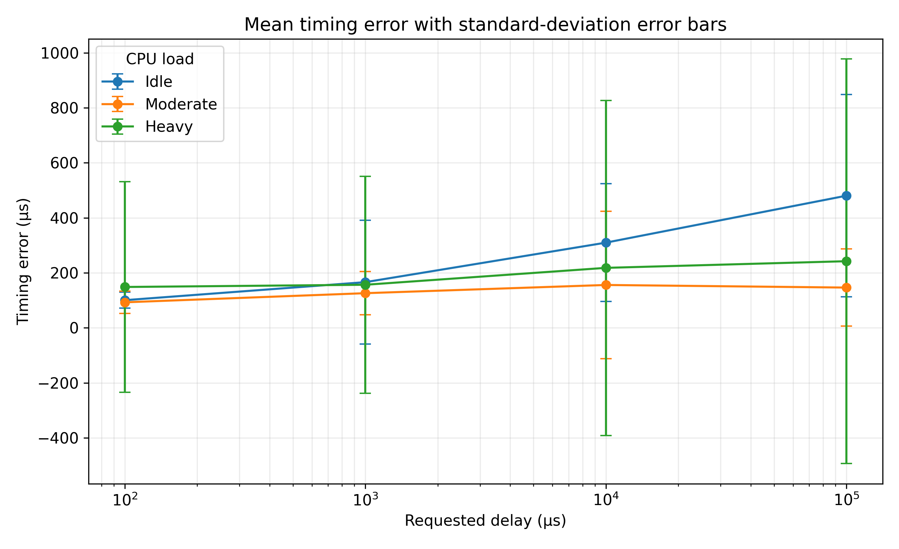
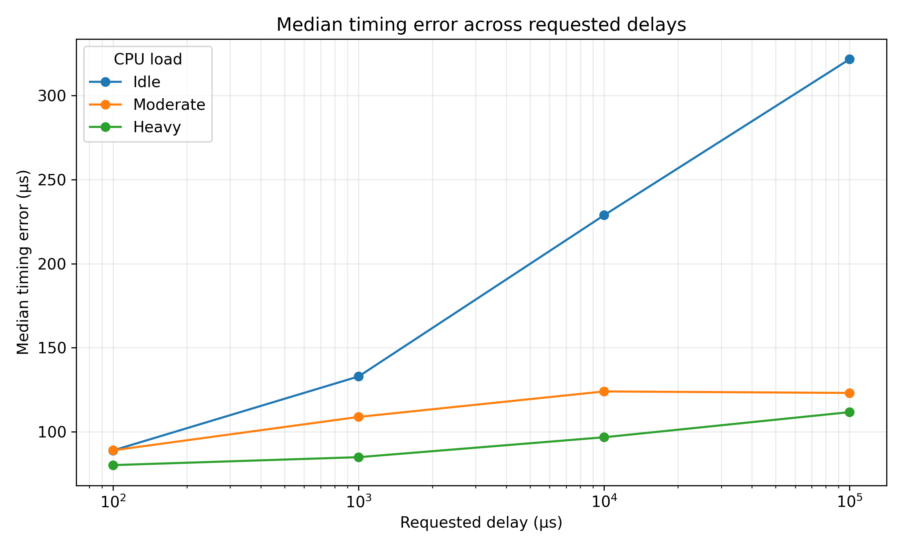
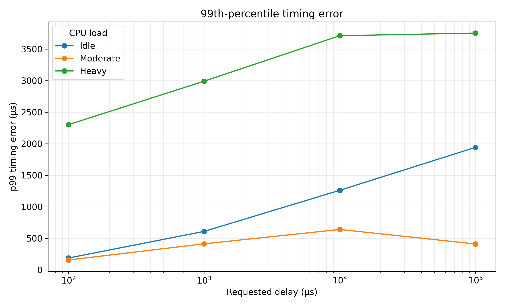
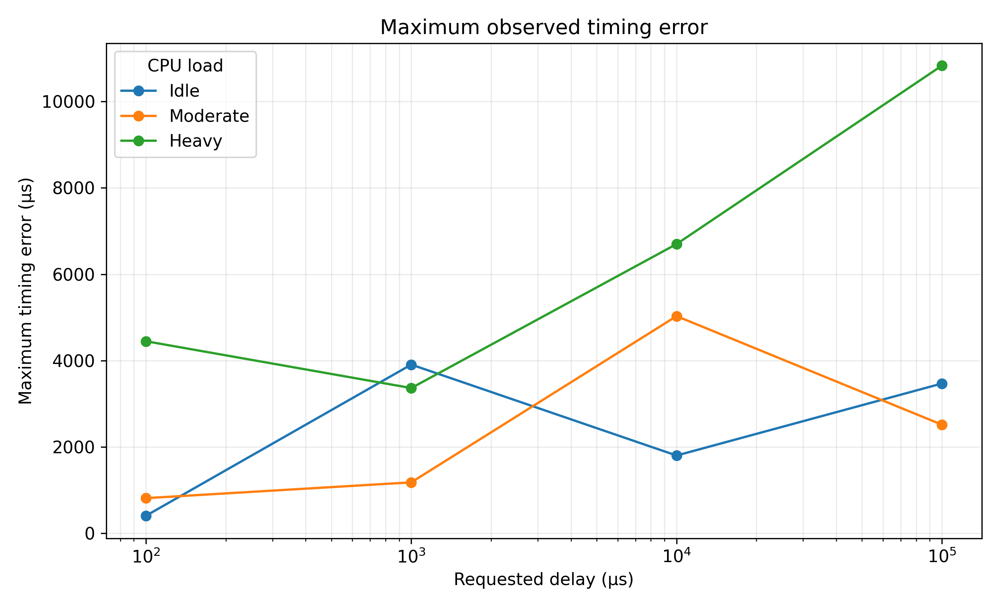
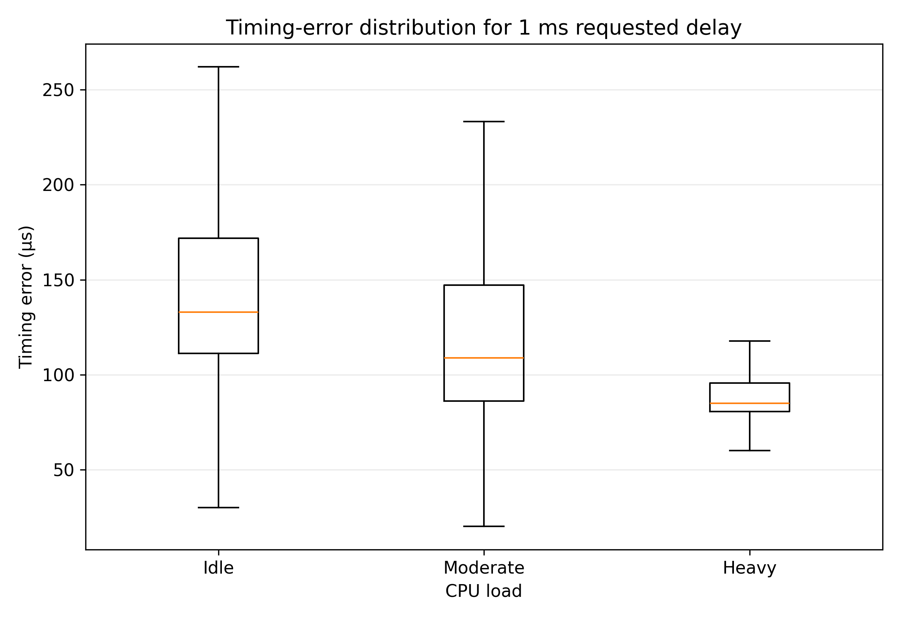

# High-Resolution Timers in the Linux Kernel

## An empirical case study of hrtimer-backed userspace timing under WSL2

**Operating Systems case-study report**  
**Focus:** Kernel time management  
**Experimental environment:** Linux under Windows Subsystem for Linux 2 (WSL2)  
**Dataset:** 6,000 observations from 12 completed conditions

> **Evidence note.** This report distinguishes verified project evidence from architectural interpretation. The completed measurements are WSL2 userspace measurements. No native Linux dataset exists. The repository's `kernel_module/` directory is empty, and the Linux kernel source tree described by the project context is not present in the current workspace. Consequently, this report does not present unverifiable kernel-source quotations as if they had been copied from the repository. Kernel implementation claims are tied to the documented Linux timer architecture and are identified as source-level interpretation where exact local source verification is unavailable.

## Abstract

High-resolution timers address a central operating-systems problem: applications may need expiry times finer than the granularity and operating model of traditional periodic tick and timer-wheel mechanisms, while the operating system must still manage interrupts, scheduling, power, and scalability. This report studies Linux high-resolution timer behavior through an implementation-oriented review and an empirical benchmark. The benchmark uses `clock_nanosleep(CLOCK_MONOTONIC, ...)`, measures elapsed time with `clock_gettime(CLOCK_MONOTONIC, ...)`, and defines timing error as elapsed time minus the requested delay. Four requested delays (100 microseconds, 1 millisecond, 10 milliseconds, and 100 milliseconds) were tested under idle, moderate, and heavy CPU-load conditions, with 500 trials per condition.

The completed dataset contains 6,000 WSL2 observations. Typical errors were generally in the tens or hundreds of microseconds, but the distributions had materially heavier tails under several heavy-load conditions. For example, the 100 ms heavy-load condition had a median error of 111.749 microseconds, a p99 error of 3,752.243 microseconds, and a maximum observed error of 10,831.143 microseconds. The results also were not monotonic by load: moderate load sometimes had lower mean and median errors than idle. The defensible conclusion is therefore not that CPU load always makes timers slower, but that end-to-end userspace timing includes scheduling, interrupt, virtualization, and wake-up effects that can substantially affect tail latency. High-resolution timer support improves representational and expiry granularity; it does not by itself guarantee deterministic userspace execution or hard real-time behavior. A direct modern userspace jiffies comparison was not completed because POSIX sleep interfaces do not expose a clean equivalent of the historical timer-wheel path.

**Keywords:** Linux, hrtimer, jiffies, timer wheel, clocksource, clock-event device, scheduling latency, jitter, WSL2, real-time systems

# 1. Introduction

## 1.1 Motivation

Operating systems mediate between a requested time and an actual event. A process may request a sleep, a timeout may expire, or a kernel subsystem may need a callback at a specified deadline. In each case, the requested time is only one part of the result. The kernel must represent time, arrange an event, handle an interrupt, run timer logic, wake or schedule a task, and allow the task to execute. These stages create a difference between nominal timer resolution and observed application behavior.

Traditional Linux timing was closely associated with periodic ticks, `HZ`, and the `jiffies` counter. That model is efficient for many ordinary timeouts, but a periodic tick imposes a natural time scale and does not directly provide a general solution for fine-grained expiry. Linux high-resolution timers (`hrtimers`) were introduced as a separate infrastructure for precise expiry management. The important design story is not simply that hrtimers are “more accurate.” It is that Linux separated high-resolution event scheduling from the ordinary timer-wheel path while retaining both mechanisms for different workload and efficiency requirements.

## 1.2 Problem statement

The project asks how a high-resolution POSIX sleep behaves when observed from userspace, and how that behavior relates to Linux timer architecture. The measurement is intentionally end-to-end. It does not observe the instant at which a kernel timer is inserted, the exact hardware interrupt timestamp, or the callback's internal execution time. Instead, it measures the interval visible to a userspace process. This makes the experiment relevant to application behavior, but it also means that scheduling and virtualization effects cannot be attributed to hrtimer expiry alone.

## 1.3 Research question

> **How precisely can Linux's high-resolution POSIX timer facilities (backed by hrtimers) meet requested delays across varying delay magnitudes, system load conditions, and execution environments, and what do the resulting error and jitter patterns reveal about the OS design trade-offs that motivated the hrtimer subsystem?**

The completed experiment addresses delay magnitude and CPU-load conditions in WSL2. Native Linux is discussed only as a limitation and future experiment.

## 1.4 Objectives

The study has six objectives:

1. Measure error and jitter for hrtimer-backed POSIX sleep operations.
2. Compare four requested delay magnitudes.
3. Compare idle, moderate, and heavy CPU-load conditions.
4. Separate typical-case behavior from tail behavior using percentiles and maxima.
5. Relate the observations to clocksource, clock-event, timer-queue, interrupt, and scheduler roles.
6. Assess whether a direct userspace comparison with jiffies-based timing is technically valid.

## 1.5 Contributions

The contribution is intentionally empirical rather than architectural invention. It is an empirical characterization of hrtimer-backed userspace timing under controlled CPU load in a virtualized WSL2 environment, combined with an implementation-level analysis of Linux timer design and a technically justified explanation of why a direct modern userspace jiffies comparison is problematic. The data show that relatively small typical error can coexist with millisecond-scale tail latency. This distinction is the report's central result.

# 2. Background and literature survey

## 2.1 Operating-system timers

An operating-system timer arranges for an action to occur at or after a time. The action may be a kernel callback, a timeout transition, a wake-up, or a scheduled userspace continuation. A useful conceptual pipeline is:

`userspace request -> time representation -> timer insertion -> clock event -> interrupt -> expiry processing -> wake-up -> scheduling -> userspace execution`

Each arrow is a possible source of latency. A timer can have fine representation without producing equally fine application execution. The distinction matters throughout this report:

- **Resolution** is the smallest time unit representable or requested by an interface or clock.
- **Accuracy** is closeness to the requested expiry.
- **Latency** is the delay between an intended event and its actual handling or execution.
- **Jitter** is variation in observed latency or error.
- **Timer expiry** is the kernel timer event becoming due.
- **Userspace wake-up latency** includes the time until the process actually resumes and reaches its measurement point.

These terms are related, but they are not interchangeable.

## 2.2 Tick, HZ, and jiffies

`HZ` describes the configured number of periodic timer ticks per second, and `jiffies` is a kernel tick counter. In a simple periodic-tick model, the tick interval is approximately $1/HZ$. A 250 Hz tick, for example, has a nominal interval of 4 ms. This does not mean all Linux time is limited to 4 ms, because modern Linux has high-resolution clocks and event devices, but it explains why a tick-centric design is not sufficient for every fine-grained timing requirement.

Jiffies remain useful for inexpensive kernel timeouts and accounting where exact sub-tick expiry is unnecessary. A design that made every timeout use the most precise possible representation and interrupt would pay unnecessary management and power costs. Linux therefore retains specialized mechanisms rather than treating every timer as a real-time deadline.

## 2.3 Traditional timer mechanisms

The historical timer-wheel approach groups timers into buckets based on expiry ranges. This provides efficient insertion and expiration for large populations of ordinary timers. Its strength is throughput and bounded management work for common timeout workloads, not arbitrary nanosecond-scale ordering. A timer wheel is particularly attractive when exact ordering among very close deadlines is unnecessary.

The design trade-off is important: a data structure optimized for ordinary timeouts should not be forced to provide the semantics of a precise event scheduler. Hrtimers provide a separate ordered mechanism for deadlines where fine-grained expiry matters. The two paths coexist because general-purpose operating systems need both efficiency and precision.

## 2.4 Motivation for high-resolution timers

Gleixner and Niehaus describe hrtimers as part of a transformation of Linux time subsystems: time representation becomes independent of the periodic tick, and high-resolution event scheduling is separated from the ordinary timer-wheel design [1]. The architecture uses a clocksource to read time and a clock-event device to request the next event. This is a division of labor: one component answers “what time is it?” while the other answers “when should the next event interrupt the CPU?”

That separation permits finer timer expiry where hardware and kernel configuration support it. It does not remove the need for scheduling. Once a timer is due, a process can still be delayed by interrupt context, preemption rules, runnable tasks, CPU placement, or virtualization.

## 2.5 Related research

Gleixner and Niehaus's *Hrtimers and Beyond: Transforming the Linux Time Subsystems* provides the core architectural context for this project [1]. Its contribution is the explanation of why the timer wheel and high-resolution timers should be separate, and how clocksources and clock events support that separation. It supplies the design rationale against which the present userspace measurements can be interpreted.

Reghenzani, Massari, and Fornaciari's survey of PREEMPT_RT places timer behavior within the broader problem of real-time Linux [2]. Its relevance is that precise timer expiry is necessary but not sufficient for predictable execution. Real-time behavior also depends on preemption, interrupt handling, priority, locking, and scheduling latency. The Linux real-time documentation likewise distinguishes general-purpose kernel behavior from real-time requirements [7]. This supports the report's distinction between hrtimer resolution and end-to-end userspace determinism.

Patel, Vanga, and Brandenburg's TimerShield addresses interference from timers in high-priority real-time systems [3]. Its contribution is to emphasize that timer activity itself can affect high-priority work. This complements the present experiment: the benchmark measures the wake-up path of one process under a simple load model, whereas real-time systems must reason about interference, priorities, and task protection more directly.

Together, these sources support a layered interpretation. The hrtimer paper explains the timer mechanism; the PREEMPT_RT survey explains why the surrounding kernel execution model matters; TimerShield illustrates why timer-related interference remains a real-time concern. The present project contributes a small, reproducible WSL2 measurement study rather than a native hard-real-time evaluation.

## 2.6 Research gap and project positioning

The project does not establish a new timer algorithm and does not compare bare-metal Linux with WSL2. Its narrower position is useful: it measures what a userspace application actually sees when using a high-resolution sleep interface across delay scales and load states. The study therefore connects kernel design to application-visible timing without confusing the two. Its main gap is also explicit: because no kernel-level `timer_list` versus `hrtimer` module was completed, the report cannot quantify the historical mechanism difference directly.

# 3. Linux timer architecture

## 3.1 Clocksource

A clocksource provides a way to read the current time or a monotonically advancing time base. It answers approximately, “what time is it?” The benchmark's use of `CLOCK_MONOTONIC` is appropriate for elapsed-time measurement because it is not intended to follow wall-clock corrections. The clocksource is therefore part of both the requested sleep path and the measurement path, although the benchmark only exposes the combined userspace result [4][5].

## 3.2 Clock-event devices

A clock-event device is programmable: it can be configured to produce a timer event at a requested future point. It answers approximately, “when should the CPU receive the next timer event?” High-resolution operation depends on suitable clock-event support. A fine-grained clocksource alone would not be enough if the system could not arrange an event at the required time [4][5].

## 3.3 Traditional timer path

The ordinary timer path is associated with `timer_list`, jiffies, and the timer-wheel infrastructure. It remains appropriate for many kernel timeouts because it is efficient and integrated with general kernel work. The design does not imply that ordinary timers are useless or always inaccurate; it means that their objectives differ from those of a deadline ordered at high temporal resolution.

## 3.4 hrtimer architecture

An hrtimer stores an expiry represented using high-resolution time units and is managed separately from ordinary timer-wheel timers [4][5]. The project context identifies `kernel/time/hrtimer.c` as the main implementation and names the lifecycle functions `hrtimer_setup()`, `enqueue_hrtimer()`, `hrtimer_start_range_ns()`, `__run_hrtimer()`, and `hrtimer_interrupt()`. Conceptually, these functions cover setup, insertion, start-time selection, callback execution, and interrupt-driven expiry processing.

The userspace benchmark does not call those functions directly. A POSIX sleep request enters the kernel through the POSIX timekeeping and sleep implementation; on a high-resolution-capable Linux system, that path uses hrtimer-backed mechanisms [5][6]. The correct claim is therefore “the benchmark observes a high-resolution POSIX sleep path backed by kernel timer infrastructure,” not “the application directly controls an hrtimer.”

## 3.5 Timer queues and per-CPU structures

The project context identifies `timerqueue.c` and ordered timer management as supporting infrastructure. An ordered queue makes the earliest expiry available for processing without scanning all timers. Per-CPU organization reduces shared contention and allows an event to be associated with the CPU that will handle it. This improves scalability, but it also makes CPU placement relevant to observed behavior.

Per-CPU organization is not a guarantee that a userspace process runs immediately when its timer expires. It only establishes where timer work is managed. The process may still wait for the scheduler, and WSL2 adds guest-host scheduling and virtual timer effects. This is one reason the experiment's CPU pinning is useful but not sufficient to isolate all sources of delay.

## 3.6 Timer expiry and interrupt handling

When the programmed clock event occurs, the hrtimer interrupt path identifies timers whose expiry is due and runs or dispatches their callbacks. For a sleep operation, expiry processing contributes to making the sleeping task runnable; the task's actual continuation is a scheduling event. The timer interrupt therefore marks an important boundary, but it is not identical to the `clock_gettime()` call after `clock_nanosleep()` returns [4][5][6].

The project requested short excerpts from the local Linux source. That material is not available in this repository: `kernel_module/` is empty and no `linux/` source tree or matching `/usr/src` tree was found. To preserve evidence discipline, no verbatim `hrtimer.c` listing is fabricated here. The report instead records the exact symbols and architecture to be checked against a supplied kernel tree, and uses the verified userspace listings below. A future revision should add a short, version-matched excerpt of `hrtimer_setup()`, `enqueue_hrtimer()`, and `hrtimer_interrupt()` once the source tree is restored.

# 4. Linux hrtimer implementation analysis

## 4.1 Relevant implementation boundary

The implementation boundary is best understood as four stages:

1. **Initialization:** construct an hrtimer with a clock base and callback.
2. **Start and enqueue:** compute an absolute expiry and insert the timer into ordered per-CPU management.
3. **Clock event and interrupt:** program or reprogram the relevant clock event and process timers that have become due.
4. **Callback and wake-up:** execute timer work, which may wake a task or cause a periodic timer to be restarted.

The functions named in the project context map naturally onto these stages. `hrtimer_setup()` establishes timer state and callback association. `hrtimer_start_range_ns()` starts a timer with an expiry and optional slack range. `enqueue_hrtimer()` places it in the ordered queue. `hrtimer_interrupt()` is the interrupt-side entry point. `__run_hrtimer()` handles the due timer callback path.

## 4.2 Expiry ordering

Ordered expiry is important because the next timer event can be selected from the earliest deadline. This is more direct for high-resolution deadlines than treating all future timeouts as coarse buckets. The cost is additional data-structure and clock-event management compared with a simple periodic tick or bucketed timer path.

## 4.3 Callback execution

A timer becoming due does not imply that arbitrary userspace code executes in interrupt context. Kernel timer processing changes kernel state, invokes a callback, or wakes a task. The scheduler then decides when the task runs. This distinction explains why the benchmark's error may be positive and variable even when the hrtimer deadline representation is fine-grained.

## 4.4 Range, slack, and efficiency

High-resolution timer APIs need not always demand an individually precise interrupt. Timer slack or a permitted range can allow coalescing and reduce wake-ups. This is an OS design trade-off between exactness and efficiency. A system that interrupts for every tiny deadline may improve timing for one task while increasing CPU activity, power consumption, cache disruption, and interference for others.

## 4.5 Implementation-to-measurement connection

The experiment's observed error is consistent with the architecture's layered behavior. The requested delay is represented precisely, but the measured endpoint occurs after expiry processing, wake-up, scheduling, and userspace execution. Under heavy load, occasional delays can grow much more than the median. This is exactly the kind of result expected when a high-resolution timer mechanism is embedded in a general-purpose, virtualized operating system rather than a fully isolated hard-real-time system.

## 4.6 Evidence boundary

The implementation discussion is intentionally split between architecture supported by the cited Linux documentation and source-level facts that require the missing checkout. The repository does not contain exact versions of `hrtimer.c`, `timerqueue.c`, `jiffies.c`, `timer.c`, `clockevents.c`, or `clocksource.c`; therefore, the report includes no invented kernel listing. Restoring a version-matched source tree is required before adding exact excerpts from `hrtimer_setup()`, `hrtimer_start_range_ns()`, `enqueue_hrtimer()`, `hrtimer_interrupt()`, or `__run_hrtimer()`.

# 5. Research question and hypotheses

The research question is stated in Section 1.3. The experiment tests the following cautious hypotheses rather than assuming that load effects must be monotonic:

- **H1, delay scale:** observed error will remain smaller than the requested delay in typical cases, but its central tendency may vary with requested delay because the measurement includes wake-up and scheduling overhead.
- **H2, tail sensitivity:** heavy CPU contention will be associated with larger p95, p99, maximum, or standard-deviation values in at least some conditions, even if its median is not the largest.
- **H3, non-monotonic typical behavior:** mean and median error will not necessarily increase monotonically from idle to moderate to heavy load because the experiment runs in WSL2 and uses a simple busy-loop model.

These are empirical expectations, not claims about Linux guarantees. H2 is evaluated through the tail statistics, while H3 is important because a lower median under load must not be incorrectly interpreted as better overall real-time behavior.

# 6. Experimental methodology

## 6.1 Research design

The design is a repeated-measures comparison across two independent factors:

- Requested delay: 100 µs, 1 ms, 10 ms, 100 ms.
- CPU load: idle, moderate, heavy.

There are 12 conditions and 500 trials per condition. The total is therefore $4 \times 3 \times 500 = 6000$ observations.

## 6.2 Userspace benchmark

The benchmark source is `src/timer_benchmark.c`. The central measurement loop is reproduced below.

```c
if (clock_gettime(CLOCK_MONOTONIC, &start) != 0) {
    perror("clock_gettime");
    free(errors);
    return 1;
}

int ret = clock_nanosleep(
    CLOCK_MONOTONIC,
    0,
    &requested,
    NULL
);

if (ret != 0) {
    fprintf(stderr,
            "clock_nanosleep failed: %s\n",
            strerror(ret));
    free(errors);
    return 1;
}

if (clock_gettime(CLOCK_MONOTONIC, &end) != 0) {
    perror("clock_gettime");
    free(errors);
    return 1;
}

int64_t start_ns = timespec_to_ns(&start);
int64_t end_ns = timespec_to_ns(&end);
int64_t actual_ns = end_ns - start_ns;
int64_t error_ns = actual_ns - requested_ns;
```

**Listing 1. Measurement loop using `CLOCK_MONOTONIC` and `clock_nanosleep()` (`src/timer_benchmark.c`).**

The listing measures the elapsed wall-clock interval from immediately before the sleep request to immediately after it returns. The error is consequently an end-to-end userspace quantity. It includes any time by which the actual sleep exceeded the requested interval, but it does not isolate timer interrupt or kernel callback timing.

The execution pipeline studied by the benchmark is:

`clock_nanosleep()` in userspace -> POSIX sleep implementation -> hrtimer-backed kernel mechanism -> clocksource/time representation -> clock-event device -> timer interrupt -> hrtimer expiry processing -> task wake-up -> scheduler dispatch -> userspace execution -> `clock_gettime()`.

The measurement begins immediately before the userspace sleep call and ends immediately after it returns. It therefore includes the combined result of the later stages, but does not directly isolate hardware timer interrupt latency, hrtimer callback latency, task wake-up latency, scheduler dispatch latency, or Windows host scheduling delay. This boundary is why the result is described as end-to-end userspace timing rather than a direct measurement of hrtimer precision.

The benchmark stores all errors, sorts them, and computes mean, p50, p90, p95, p99, minimum, maximum, and population standard deviation. Its percentile interpolation uses the position $p(n-1)$, consistent with the Python analysis script.

## 6.3 CPU load generator

The load program is `src/cpu_load.c`. Each worker performs a dependency-free integer busy loop until the process receives `SIGINT`.

```c
void *cpu_worker(void *arg)
{
    (void)arg;

    volatile uint64_t x = 123456789;

    while (!stop) {
        x = x * 1103515245ULL + 12345ULL;
        x ^= x >> 13;
        x *= 2654435761ULL;
    }

    return NULL;
}
```

**Listing 2. CPU-load worker loop (`src/cpu_load.c`).**

The loop creates sustained runnable CPU work but is not a complete real-time interference model. It does not generate controlled interrupt rates, I/O contention, priority inversion, cache pressure, or host-level load. It is therefore best interpreted as a repeatable CPU-contention condition.

## 6.4 Measurement configuration

The WSL2 environment reported 12 logical CPUs. The benchmark was pinned to CPU 0. Idle used zero load workers; moderate used six workers pinned to CPUs 1–6; heavy used eleven workers pinned to CPUs 1–11. The orchestration script, `scripts/run_final_experiment.sh`, starts the load process with `taskset`, waits one second, and runs 500 benchmark trials for each condition.

| Parameter | Configuration |
|---|---|
| Environment | Linux under WSL2 |
| Logical CPUs reported | 12 |
| Benchmark CPU | CPU 0 |
| Idle load | 0 workers |
| Moderate load | 6 workers, CPUs 1–6 |
| Heavy load | 11 workers, CPUs 1–11 |
| Requested delays | 100 µs, 1 ms, 10 ms, 100 ms |
| Trials per condition | 500 |
| Total conditions | 12 |
| Total observations | 6,000 |
| Time source | `CLOCK_MONOTONIC` |
| Sleep API | `clock_nanosleep()` |
| Error | actual elapsed time − requested delay |

**Table 1. Experimental configuration.**

## 6.5 Statistical analysis

The analysis script reads the 12 raw CSV files from `data/final_wsl2/`, verifies that every file contains 500 trials, converts nanoseconds to microseconds for presentation, and writes `data/final_wsl2/analysis/wsl2_summary.csv`. The percentile definition is linear interpolation between ordered observations at position $p(n-1)$. Standard deviation is population standard deviation (`statistics.pstdev`), not sample standard deviation.

The analysis was rerun from the repository before writing this report. It produced 12 conditions and 6,000 observations and reproduced the stored summary values.

## 6.6 Reproducibility

The benchmark compilation commands documented by the project are:

```bash
gcc -O2 -Wall -Wextra -pthread src/timer_benchmark.c \
    -o build/timer_benchmark -lm
gcc -O2 -Wall -Wextra -pthread src/cpu_load.c \
    -o build/cpu_load
```

The analysis can be rerun with:

```bash
python3 scripts/analyze_final.py
python3 scripts/plot_final.py
```

The raw files and generated plots are retained in the repository. Native Linux reproduction should use the same delays, load levels, CPU-pinning strategy, trial count, and percentile definitions, while recording kernel version, host hardware, CPU governor, and scheduler details.

# 7. Experimental results

## 7.1 Overall results

All values in Tables 2 and 3 are timing error in microseconds. The complete 12-condition summary is below.

| Delay | Load | Mean | Median/p50 | p90 | p95 | p99 | Min | Max | Std. dev. |
|---|---|---:|---:|---:|---:|---:|---:|---:|---:|
| 100 µs | Idle | 100.72 | 88.98 | 134.01 | 154.33 | 188.57 | 34.73 | 407.17 | 29.38 |
| 100 µs | Moderate | 93.00 | 89.05 | 110.02 | 124.66 | 157.46 | 14.49 | 815.02 | 40.36 |
| 100 µs | Heavy | 148.74 | 80.26 | 101.86 | 326.47 | 2,301.56 | 18.03 | 4,448.84 | 382.98 |
| 1 ms | Idle | 166.26 | 132.96 | 225.69 | 262.68 | 610.67 | 30.11 | 3,907.87 | 225.00 |
| 1 ms | Moderate | 126.17 | 108.90 | 192.84 | 217.78 | 413.62 | 20.08 | 1,180.58 | 78.84 |
| 1 ms | Heavy | 156.80 | 84.98 | 108.75 | 305.50 | 2,990.28 | 27.01 | 3,364.61 | 394.56 |
| 10 ms | Idle | 309.88 | 228.81 | 576.23 | 668.97 | 1,261.43 | 78.16 | 1,802.33 | 213.87 |
| 10 ms | Moderate | 156.03 | 124.06 | 206.13 | 247.10 | 641.16 | 18.86 | 5,030.66 | 268.25 |
| 10 ms | Heavy | 218.24 | 96.81 | 165.95 | 430.90 | 3,710.83 | 43.05 | 6,699.21 | 608.99 |
| 100 ms | Idle | 480.56 | 321.55 | 862.87 | 937.35 | 1,941.33 | 93.25 | 3,469.20 | 367.25 |
| 100 ms | Moderate | 146.55 | 123.16 | 207.04 | 226.04 | 411.40 | 77.83 | 2,516.63 | 140.35 |
| 100 ms | Heavy | 242.43 | 111.75 | 162.44 | 438.86 | 3,752.24 | 35.16 | 10,831.14 | 735.05 |

**Table 2. Summary statistics for all completed WSL2 conditions.**

The minimum errors are positive in every stored condition, which is consistent with a sleep operation returning at or after its requested duration in this dataset. This is an empirical property of these observations, not a universal guarantee of the API or platform.

## 7.2 Mean and median behavior



**Figure 1. Mean timing error with standard-deviation error bars.** Source: `data/final_wsl2/figures/figure1_mean_error.png`. The mean generally rises with requested delay in the idle series, from 100.72 µs at 100 µs to 480.56 µs at 100 ms. The error bars show that the mean alone is not enough: heavy-load variability is especially large at 100 µs, 1 ms, 10 ms, and 100 ms. The figure connects to the research question by showing that delay magnitude and load affect the application-visible result, but not in a simple one-factor way.



**Figure 2. Median timing error across requested delays.** Source: `data/final_wsl2/figures/figure2_median_error.png`. The median is much less sensitive to isolated extreme observations than the maximum. Heavy load has the lowest median at all four delay magnitudes in this dataset: 80.26, 84.98, 96.81, and 111.75 µs. That does not mean heavy load is preferable, because the same conditions have much wider tails. It does demonstrate that load effects on typical behavior are not monotonic.

## 7.3 Tail behavior



**Figure 3. p99 timing error.** Source: `data/final_wsl2/figures/figure3_p99_error.png`. The p99 series exposes behavior hidden by the median. Heavy load produces p99 errors of 2,301.56 µs, 2,990.28 µs, 3,710.83 µs, and 3,752.24 µs for the four delays. The 100 ms heavy-load median is only 111.75 µs, so most observations were relatively close while at least the slowest one percent were substantially delayed. This is the most important figure for real-time interpretation.



**Figure 4. Maximum observed timing error.** Source: `data/final_wsl2/figures/figure4_max_error.png`. The largest sample was 10,831.14 µs in the 100 ms heavy-load condition. Maximum values are useful for revealing the observed scale of rare delays, but they are sample maxima from 500 trials, not worst-case guarantees. The figure therefore supports a statement about observed tail exposure, not a proof of a platform bound.

## 7.4 Key comparison

| Delay | Load | Median | p95 | p99 | Maximum |
|---|---|---:|---:|---:|---:|
| 100 µs | Idle | 88.98 | 154.33 | 188.57 | 407.17 |
| 100 µs | Moderate | 89.05 | 124.66 | 157.46 | 815.02 |
| 100 µs | Heavy | 80.26 | 326.47 | 2,301.56 | 4,448.84 |
| 1 ms | Idle | 132.96 | 262.68 | 610.67 | 3,907.87 |
| 1 ms | Moderate | 108.90 | 217.78 | 413.62 | 1,180.58 |
| 1 ms | Heavy | 84.98 | 305.50 | 2,990.28 | 3,364.61 |
| 10 ms | Idle | 228.81 | 668.97 | 1,261.43 | 1,802.33 |
| 10 ms | Moderate | 124.06 | 247.10 | 641.16 | 5,030.66 |
| 10 ms | Heavy | 96.81 | 430.90 | 3,710.83 | 6,699.21 |
| 100 ms | Idle | 321.55 | 937.35 | 1,941.33 | 3,469.20 |
| 100 ms | Moderate | 123.16 | 226.04 | 411.40 | 2,516.63 |
| 100 ms | Heavy | 111.75 | 438.86 | 3,752.24 | 10,831.14 |

**Table 3. Median, p95, p99, and maximum error for each condition.**

The contrast between p50 and p99 is more informative than any single average. For 100 ms heavy load, p99 is about 33.6 times the median, and the maximum is about 96.9 times the median. These ratios are descriptive for this sample, not universal performance factors.

## 7.5 Distribution analysis



**Figure 5. Timing-error distribution for the 1 ms requested delay under three load conditions. The boxplot summarizes the central distribution; extreme tail behavior is reported separately using p99 and maximum values.** Source: `data/final_wsl2/figures/figure5_1ms_boxplot.png`. The plotting script uses `showfliers=False`, so extreme points are omitted from the displayed boxplot for readability. The medians are approximately 132.96 µs idle, 108.90 µs moderate, and 84.98 µs heavy. The heavy condition's lower median must be read alongside its p99 of 2,990.28 µs and standard deviation of 394.56 µs; Table 3 retains the full tail statistics.

## 7.6 Unexpected and non-monotonic observations

Moderate load is lower than idle in mean, median, p95, p99, and maximum for the 1 ms condition. At 10 ms and 100 ms, moderate load also has lower mean and p99 than idle, although it has a larger maximum at 10 ms and a lower maximum at 100 ms. Heavy load has lower medians than idle in every delay condition but has much larger p99 or maximum values in most cases.

These observations rule out the simplistic claim that “more CPU load always increases timing error.” Possible explanations include WSL2 host scheduling, virtual CPU placement, guest scheduling decisions, run-to-run variability, and the fact that the busy-loop load is not a controlled real-time stressor. The dataset supports those as plausible explanations, not as proven causes. It does support the narrower observation that typical latency and tail latency respond differently to the tested conditions.

# 8. Discussion and critical analysis

## 8.1 What the results mean

The measurements show that the hrtimer-backed sleep path can produce relatively small typical additional delays compared with the requested intervals, but that the userspace result is not deterministic. The central 100 ms heavy-load result is particularly clear: median error is 111.75 µs, while p99 reaches 3.75 ms and the maximum reaches 10.83 ms. Most trials and rare trials describe different operational risks.

This matters because a control loop, media deadline, or real-time task may be designed around a percentile or a defensible upper bound rather than the median. A median-only evaluation could report the heavy condition as best among the three load levels at 100 ms, despite its largest observed maximum and a much worse p99 than moderate load.

## 8.2 Resolution versus accuracy

The ability to represent a delay in nanoseconds is a resolution property. It is not a promise that a userspace thread will execute at a nanosecond boundary. Accuracy is affected by the complete timer and scheduling path. The WSL2 results do not measure the hrtimer clock-event resolution in isolation; they measure the difference between a requested sleep and a userspace timestamp after wake-up.

Therefore, the experiment cannot support the statement “Linux hrtimers are accurate to X microseconds” in a general sense. It supports the more precise statement that this WSL2 configuration produced the reported end-to-end wake-up errors for this benchmark and load model.

## 8.3 Timer expiry versus userspace wake-up

A timer may become due in the kernel before the process's post-sleep `clock_gettime()` executes. Interrupt entry, expiry processing, waking a task, choosing it to run, and entering userspace are distinct events. This distinction is the main reason the benchmark should not be treated as a direct measurement of `hrtimer_interrupt()` latency.

It also explains why isolating the benchmark on CPU 0 does not eliminate all uncertainty. The timer infrastructure, scheduler, virtual CPU, and host may still contribute to the observed interval. CPU affinity reduces one source of contention; it does not turn a general-purpose guest into a hard-real-time environment.

## 8.4 Scheduling and interrupt latency

Under heavy load, rare delays can occur even when the median remains low. The tail is sensitive to the system's ability to service an event and schedule the target task at the right time. A high-resolution timer makes an earlier or more precise event possible; it does not force the scheduler to dispatch the task immediately.

The dataset cannot determine whether each outlier was caused by a delayed virtual interrupt, guest scheduling, host descheduling, a kernel critical section, or another event. Tracing would be needed to attribute individual delays. The correct interpretation is therefore causal restraint: the architecture makes these stages possible, and the measurements reveal their combined effect.

## 8.5 CPU load and tail latency

Heavy load is associated with broad dispersion in several conditions. At 100 ms, standard deviation increases from 367.25 µs idle to 735.05 µs heavy, and p99 increases from 1,941.33 µs to 3,752.24 µs. At 10 ms, p99 rises from 1,261.43 µs idle to 3,710.83 µs heavy. These are strong sample-level differences in the tail.

However, the moderate series prevents a one-direction story. Moderate load can reduce typical and tail values relative to idle. That may reflect uncontrolled host state or sampling variability, and it reinforces why more trials, repeated runs, and tracing are needed before making a general load-response claim.

## 8.6 WSL2 and virtualization effects

WSL2 is a virtualized environment. The benchmark runs in a Linux guest context whose execution depends on virtual CPUs and the Windows host scheduler. The measurements are valid for the tested environment, but they should not be generalized automatically to bare-metal Linux, a PREEMPT_RT kernel, or a certified real-time platform.

Virtualization is not merely noise to be ignored. It is part of the execution environment that the application experiences. It may amplify or reshape tail latency, which makes the dataset useful as a WSL2 case study while limiting claims about native kernel behavior.

## 8.7 Real-time implications

The result is directly relevant to real-time reasoning: average or median behavior is insufficient when deadlines are hard. A system with a 100 µs median error may still have occasional multi-millisecond delays. Hrtimers are an enabling mechanism for precise deadline representation and expiry, but real-time predictability additionally requires suitable scheduling, preemption, interrupt, CPU-isolation, and system configuration properties [2][7]. The `rtla timerlat` tool is relevant future instrumentation because it is designed to expose timer latency rather than only the application-level endpoint [8].

The experiment does not establish a hard upper bound. Its maximum values are sample maxima from 500 trials. It does establish that the tested environment produced rare delays large enough to matter for some deadlines.

## 8.8 Why a direct jiffies comparison is difficult

The original case-study wording suggests comparing hrtimers with jiffies-based timers. A direct modern userspace comparison is not technically clean. `clock_nanosleep()` is not paired with a public “jiffies sleep” API that differs only in timer mechanism. Treating `usleep()` as a jiffies timer would be an unsupported equivalence; both interfaces may be implemented through modern kernel paths and scheduling facilities.

A meaningful comparison would be kernel-level: create a `timer_list` timer using the ordinary timer path and an `hrtimer` using the high-resolution path, timestamp their expiry from kernel context, and compare granularity, ordering, and latency under controlled conditions. The repository contains no such completed module: `kernel_module/` is empty. This is therefore a limitation and future-work item, not a missing result to be filled with fabricated values.

## 8.9 OS design trade-offs

The central trade-off is precision versus overhead. Higher-resolution expiry can improve deadline placement, but it may require more timer management, more frequent clock-event programming, more interrupts, more CPU activity, and more opportunities for interference. Ordered structures and per-CPU state improve deadline management and scalability, but add implementation complexity and do not remove scheduler latency.

Linux does not make every timeout maximally high-resolution because general-purpose workloads often value throughput, low overhead, power efficiency, and timer coalescing. The coexistence of timer-wheel and hrtimer mechanisms is therefore a design compromise: use inexpensive ordinary timing where exact expiry is unnecessary, and use high-resolution infrastructure where the workload justifies its cost.

# 9. Limitations and threats to validity

## 9.1 WSL2 environment

Only WSL2 results are available. No native or bare-metal Linux experiment was completed. WSL2 virtual CPUs and the Windows host scheduler are part of the execution environment and can affect the observed tails, so the results must not be presented as native Linux worst-case behavior.

## 9.2 CPU-load model

The load generator uses busy-loop worker threads. It does not model I/O, interrupt storms, kernel locks, priority inversion, cache interference, power-management transitions, or real-time priorities. The three load labels describe this experiment's worker configuration, not universal system-load categories.

## 9.3 Number of trials

Five hundred trials per condition are enough to expose substantial differences in this dataset, but p99 is determined by only a small number of observations and maxima are especially sample-dependent. The maximum observed delay is not a proof of the system's worst-case latency. Longer repeated runs are required for stronger extreme-tail claims or any attempt to establish a bound.

## 9.4 Lack of native Linux results

The report contains no native Linux table, comparison figure, or implied native baseline. This prevents separating WSL2 effects from generic Linux behavior.

## 9.5 End-to-end measurement

The benchmark measures from a userspace timestamp before sleep to a userspace timestamp after return. It does not instrument timer insertion, clock-event programming, hardware or virtual interrupt arrival, hrtimer callback execution, task wake-up, scheduler dispatch, or Windows host scheduling separately. It therefore cannot attribute any individual outlier to one stage of the pipeline.

## 9.6 Lack of direct jiffies comparison

The repository has no completed kernel module and no fair modern userspace jiffies equivalent. The report therefore does not claim an empirical hrtimer-versus-jiffies performance ratio.

## 9.7 Kernel-source availability discrepancy

`MASTER_CONTEXT.md` states that a Linux source repository was cloned and inspected, but that tree is not present in the current workspace. The report treats the documented function names and architecture as project context, not as locally reproducible source evidence. A version-matched kernel checkout is needed to add exact implementation listings.

## 9.8 Hard real-time validity

The experiment does not establish a hard real-time worst-case guarantee. It has no native Linux baseline, no kernel tracing, no completed `timer_list` versus `hrtimer` module, no real-time scheduling experiment, and no proof that the observed maximum bounds future executions. Its conclusions are about this measured WSL2 sample and its distributions.

# 10. Future work

1. Repeat the identical experiment on native Linux and record kernel, hardware, CPU governor, and scheduler details.
2. Implement a kernel module that compares `timer_list` and `hrtimer` at the mechanism level, with kernel timestamps and explicit caveats about non-equivalent APIs.
3. Increase trial counts and repeat each condition across multiple runs and host states.
4. Use ftrace, perf, or equivalent tracing to separate timer expiry, interrupt, wake-up, and scheduling latency.
5. Run `rtla timerlat` to characterize timer latency with tooling designed for real-time analysis.
6. Compare ordinary scheduling with real-time policies and, where appropriate, a PREEMPT_RT environment.
7. Test CPU affinity, isolation, frequency scaling, and host load as separate factors rather than combining them with the load model.
8. Restore the exact Linux source tree and add short, version-matched excerpts from `hrtimer.c`, `timerqueue.c`, `clockevents.c`, and related files.

# 11. Conclusion

The WSL2 experiment answers the research question with an important qualification. Linux's high-resolution POSIX sleep facility can produce relatively small typical timing error across requested delays from 100 µs to 100 ms, but the observed userspace result is shaped by more than timer representation. Under heavy load, the tails can reach the millisecond range even when the median remains near one hundred microseconds. The 100 ms heavy-load condition is the clearest example: 111.749 µs median, 3,752.243 µs p99, and 10,831.143 µs maximum among 500 trials.

The results do not show that heavy load always increases mean or median error. Moderate load sometimes performs better than idle, and heavy load often has a lower median than idle. They do show that typical-case and tail behavior must be analyzed separately, and that load-associated tail risk is visible in this WSL2 dataset.

The kernel design explains why this result is plausible. Hrtimers provide an ordered, high-resolution timer mechanism supported by clocksource and clock-event infrastructure, while ordinary timer-wheel mechanisms remain useful for efficient general-purpose timeouts. That architecture improves the system's ability to place timer expiry precisely, but it does not guarantee immediate userspace execution. Scheduling, interrupts, CPU placement, and virtualization remain part of the measured path.

The defensible project conclusion is therefore: **high-resolution timer infrastructure is necessary for precise timer expiry, but it is not sufficient for deterministic userspace timing or hard real-time guarantees.** The project's contribution is an evidence-based WSL2 characterization of that distinction, not a claim about native Linux worst-case behavior and not a direct jiffies benchmark.

# 12. References

[1] Thomas Gleixner and Douglas Niehaus. “Hrtimers and Beyond: Transforming the Linux Time Subsystems.” *Linux Symposium*, 2006, vol. 1, pp. 333–346. https://www.kernel.org/doc/ols/2006/ols2006v1-pages-333-346.pdf
[2] Federico Reghenzani, Giuseppe Massari, and William Fornaciari. “The Real-Time Linux Kernel: A Survey on PREEMPT_RT.” *ACM Computing Surveys*, 52(1), Article 18, 2019. https://doi.org/10.1145/3297714
[3] Pratyush Patel, Manohar Vanga, and Björn B. Brandenburg. “TimerShield: Protecting High-Priority Tasks from Low-Priority Timer Interference.” *2017 IEEE Real-Time and Embedded Technology and Applications Symposium*, pp. 3–12, 2017. https://doi.org/10.1109/RTAS.2017.40
[4] Linux kernel documentation. “High-resolution timers.” https://docs.kernel.org/timers/highres.html
[5] Linux kernel documentation. “hrtimers.” https://docs.kernel.org/timers/hrtimers.html
[6] Linux kernel documentation. “Delay and sleep functions.” https://docs.kernel.org/timers/delay_sleep_functions.html
[7] Linux kernel documentation. “Real-time kernel differences.” https://docs.kernel.org/core-api/real-time/differences.html
[8] Linux kernel documentation. “rtla timerlat.” https://docs.kernel.org/tools/rtla/rtla-timerlat.html

# Appendix A. Project evidence and files

The report's numerical results come from the raw CSV files in `data/final_wsl2/` and the regenerated summary `data/final_wsl2/analysis/wsl2_summary.csv`. The five figures are the generated PNG files in `data/final_wsl2/figures/`. The benchmark and load listings are taken from `src/timer_benchmark.c` and `src/cpu_load.c`; the statistical procedure is implemented in `scripts/analyze_final.py` and the figures in `scripts/plot_final.py`.

The project also contains `src/check_resolution.c`, which reports `clock_getres(CLOCK_MONOTONIC, ...)`. That utility concerns reported clock resolution and is conceptually useful, but its output is not included as an experimental result because no corresponding captured output is present in the completed dataset.

# Appendix B. Conditions and asset manifest

| Report asset | Repository path | Status |
|---|---|---|
| Raw measurements | `data/final_wsl2/*.csv` | Present; 12 files, 500 rows each |
| Summary statistics | `data/final_wsl2/analysis/wsl2_summary.csv` | Present and regenerated |
| Mean plot | `data/final_wsl2/figures/figure1_mean_error.png` | Present |
| Median plot | `data/final_wsl2/figures/figure2_median_error.png` | Present |
| p99 plot | `data/final_wsl2/figures/figure3_p99_error.png` | Present |
| Maximum plot | `data/final_wsl2/figures/figure4_max_error.png` | Present |
| 1 ms boxplot | `data/final_wsl2/figures/figure5_1ms_boxplot.png` | Present |
| Kernel module | `kernel_module/` | Empty; no results |
| Native Linux data | Not present | Not completed |
| Local Linux source tree | Not present | Required for exact kernel listings |
